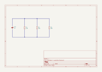

# Resistance calculation

## Schematics

## resistors

* $R_1=100Ω$
* $R_2=200Ω$
* $R_3=300Ω$

## power supply

* Power supply; $V=9VDC$ (Battery)

## Calculations to be made

* Total current ; $I_{total}$
* Total resistance ; $R_{total}$
* Voltage drop ; $V_{drop}$

## Formulas to be used

* Ohms law to calculate Resistance($R$), Voltage($V$), Current($I$) ; $R = \frac{V}{I}$

-----

* Total resistance (parallel); $R_{total}=\frac{1}{\frac{1}{R_1}+\frac{1}{R_2}+\frac{1}{R_3}\dots+\frac{1}{R_n}}$

-----

### Calculation - Total resistance $R_{total}$

$R_{total} = \frac{1}{\frac{1}{R_1}+\frac{1}{R_2}+\frac{1}{R_3}}$

$R_{total} = \frac{1}{\frac{1}{100}+\frac{1}{200}+\frac{1}{300}}$

$R_{total} = \frac{1}{\frac{6}{600}+\frac{3}{600}+\frac{2}{600}}$

$R_{total} = \frac{1}{\frac{11}{600}}$

$R_{total} = \frac{600}{1}$

$R_{total} = 54.55Ω$
-

### Calculation - Total current $I_{total}$

* Using $R_{total}$ we are able to calculate $I_{total}$ as we know voltage $V=9V$
* As we have all components in parallel, current across each resistor will be different.
* Formula to calculate current across resistors $I_{R_n}=\frac{V}{R_n}$

$I_{total}=\frac{V}{R_{total}}$

$I_{total}=\frac{9}{54.55}$

$I_{total}=0.165A$
-

* Current across $R_1(I_{R_1})$

$I_{R_1} = V ÷ R_1$

$I_{R_1} = 9 ÷ 100$

$I_{R_1} = 90 mA (0.09A)$
-

* Current across $R_2(I_{R_2})$

$I_{R_2} = V ÷ R_2$

$I_{R_2} = 9 ÷ 200$

$I_{R_2} = 45mA (0.045A)$
-

* Current across $R_3(I_{R_3})$

$I_{R_3} = V ÷ R_3$

$I_{R_3} = 9 ÷ 300$

$I_{R_3} = 30mA(0.03A)$
-

* Kirchhoff's law met.

$I_{R_1}+I_{R_2}+I_{R_3}=I_{total}$

### Calculation - Voltage drop $V_{drop}(R_1, R_2,R_3)$

* Voltage drop on  each resistor should be equal to total voltage in circuit as we have components in parallel we do calculation with constant voltage $V_{constant} = 9V$
* Formula $V_{R_n}=I_{R_n}×R_n$

$V_{R_1}=I_{R_1}×R_1$

$V_{R_1}=0.09×100$

$V_{R_1}=9V$
-

$V_{R_2}=I_{R_2}×R_2$

$V_{R_2}=0.045×200$

$V_{R_2}=9V$
-

$V_{R_3}=I_{R_3}×R_3$

$V_{R_3}=0.03×300$

$V_{R_3}=9V$
-

* Kirchhoff's law met

$V_{R_1},V_{R_2},V_{R_3}=V_{constant}$